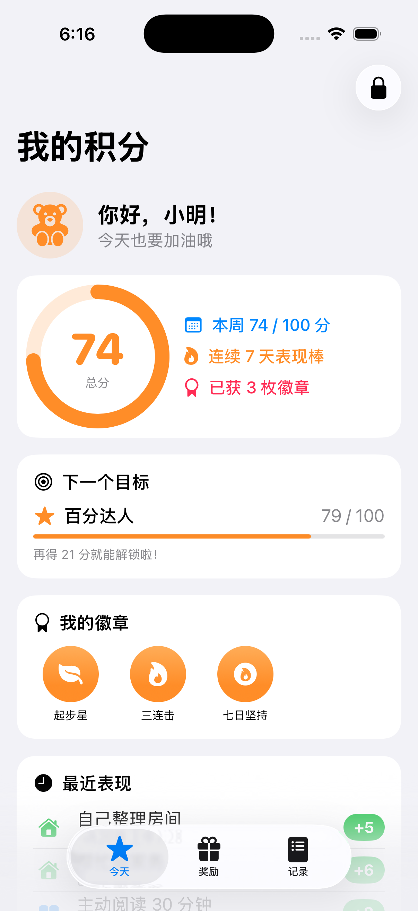
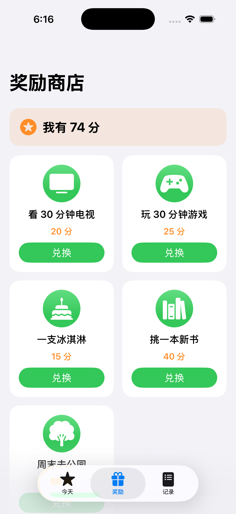
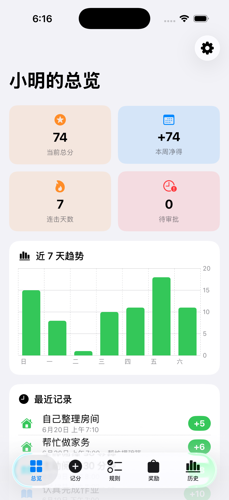
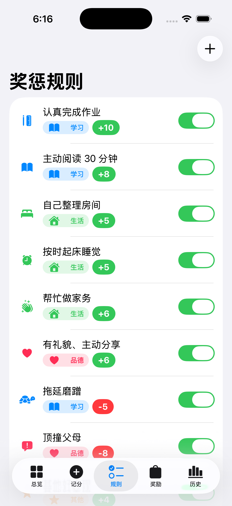
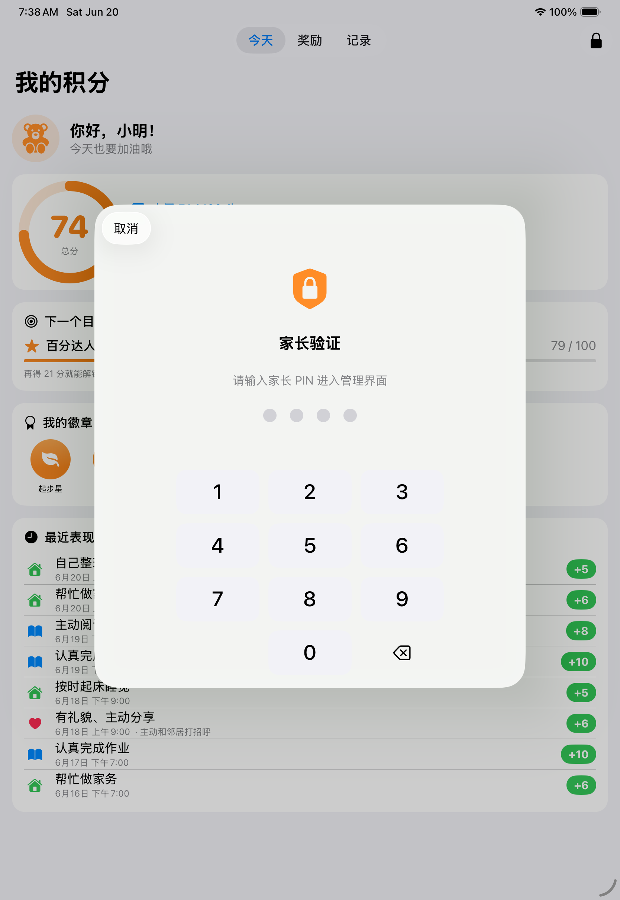

# 行为奖励 · RewardingSystem

一个面向家庭的 **孩子行为奖惩 iOS App**（universal，适配 iPhone + iPad）。用积分记录、引导孩子日常学习与生活中的好/坏行为，配合"代币经济 + 轻量游戏化"帮助养成规范习惯。

- 纯本地、离线，无需后端；数据存在本机（SwiftData）。
- 第一版只管理**一个孩子**，但数据结构已为将来多孩子预留（每条数据带 `childID`）。
- 家长（完整权限）/ 孩子（只读）双角色，家长入口受 PIN / 生物识别保护。

> 安装到真机的完整步骤见 **[SETUP.md](SETUP.md)**；所有自主设计决策见 **[DECISIONS.md](DECISIONS.md)**；需求规范见 **[Project_brief.md](Project_brief.md)**。

---

## 功能一览

| 模块 | 家长(Parent) | 孩子(Child) |
|---|---|---|
| 奖惩规则 | 增删改查、启用/停用 | — |
| 记分 | 一键按规则记分、带备注、撤销最近一次 | — |
| 总分/流水 | 查看全部历史、趋势、分类统计 | 看当前总分、最近记录、本周趋势（只读） |
| 奖励商店 | 维护奖励目录、审批兑换 | 看能兑换什么 / 还差多少分、发起兑换申请 |
| 游戏化 | — | 里程碑徽章、连击、下一目标进度 |
| 角色切换 | 退出家长模式 | 申请进入家长模式（需 PIN/生物识别） |

### 截图

| 孩子端首页 | 孩子端商店 | 家长端总览 | 家长端规则 | PIN 门禁 |
|---|---|---|---|---|
|  |  |  |  |  |

iPad（universal 自适应）：`docs/screenshots/09-ipad-child.png`、`10-ipad-parent.png`。

---

## 架构

两层、依赖单向（UI → 持久化 → 领域）：

```
┌─────────────────────────────────────────────┐
│ App (SwiftUI + SwiftData)                     │
│  Views/  ── @Query 取数 + 调用引擎/ScoreSummary │
│  Persistence/  ── @Model + RewardRepository    │
│  Auth/  ── RoleManager / PINStore / Biometric  │
└───────────────┬───────────────────────────────┘
                │ 依赖
┌───────────────▼───────────────────────────────┐
│ RewardCore (Swift Package · 纯 Foundation)     │
│  Models/  ── 值类型领域模型                      │
│  Engine/  ── ScoringEngine / StreakCalculator   │
│            BadgeEngine / RedemptionPolicy        │
│  PINHasher · SampleData                          │
└────────────────────────────────────────────────┘
```

**为什么这样分层**：业务规则（计分、连击、徽章、兑换资格）抽成 `RewardCore` 纯函数，可被 `swift test` 快速、确定性覆盖（注入 `now`/`Calendar`，无时区/随机不确定性）；SwiftData/SwiftUI 留在 App 层保持惯用法。详见 [DECISIONS.md](DECISIONS.md) D2。

- **读路径**：视图用 `@Query` 订阅 SwiftData，`map { $0.toDomain() }` 转成领域值后喂给引擎 / `ScoreSummary` 派生展示值（只有 `@Query` 能驱动 SwiftUI 刷新）。
- **写路径**：视图从 `@Environment(\.modelContext)` 构造轻量 `RewardRepository`，调用其 mutation 方法（记分/撤销/CRUD/兑换/seed）。

---

## 数据模型

### 持久化实体（`App/Persistence/SwiftDataModels.swift`，SwiftData `@Model`）

| 实体 | 关键字段 |
|---|---|
| `ChildModel` | id, name, **avatarSymbol(SF Symbol 名)**, createdAt |
| `RuleModel` | id, name, category, **points(带符号: ≥0 奖励 / <0 惩罚)**, iconName, isActive, sortOrder, createdAt, **childID** |
| `EventModel` | id, ruleID?, **ruleName/category/points(快照)**, note?, timestamp, **isVoided(软删除)**, childID |
| `RewardModel` | id, name, **cost(正分)**, iconName, isActive, sortOrder, createdAt, childID |
| `RedemptionModel` | id, rewardID?, **rewardName/cost(快照)**, **status(pending/approved/rejected)**, requestedAt, decidedAt?, childID |

设计要点：
- **快照**：流水/兑换记录保存当时的名称/分值/花费快照，家长事后改规则不会篡改历史；规则被删后 `ruleID` 置空但历史仍在。
- **软删除**：撤销记分将最近一条 `isVoided=true`，总分/趋势/列表一律排除已作废，保留审计与趋势完整性。
- **多孩子预留**：每条业务数据带 `childID`，MVP 只 seed 一个孩子。

### 领域值类型（`RewardCore/Sources/RewardCore/Models/`）

`ScoreCategory`(学习/生活/品德/其他)、`BehaviorRule`、`ScoreEvent`、`Reward`、`RedemptionRequest`(+`RedemptionStatus`)、`ChildProfile`、`Badge`/`MilestoneProgress`、`DailyScore` —— 全部 `Codable` 值类型，与持久化实体一一映射（`toDomain()` / `init(_:)`）。

### 核心业务规则（`RewardCore/Sources/RewardCore/Engine/`）

| 引擎 | 规则 |
|---|---|
| `ScoringEngine` | 余额 = Σ有效事件分 − Σ已通过兑换花费；累计获得分（仅正分，用于里程碑）；本周/区间净分；近 N 天每日净分（趋势）；最近可撤销事件；最近 N 条 |
| `StreakCalculator` | 连击 = 从今天往前数、连续每天净得分 > 0 的天数（当天 ≤0 即为 0） |
| `BadgeEngine` | 里程碑徽章（累计 50/100/200/500）+ 连击徽章（3/7 天）；下一里程碑进度 |
| `RedemptionPolicy` | 是否买得起、还差多少分、可兑换列表 |

---

## 示例数据（首次启动自动 seed）

`RewardCore/Sources/RewardCore/SampleData.swift`，字段格式：

- **孩子**：小明（`avatarSymbol = "teddybear.fill"`）。
- **9 条规则**（覆盖学习/生活/品德/其他，含奖励与惩罚）：认真完成作业 `+10`、主动阅读30分钟 `+8`、自己整理房间 `+5`、按时起床睡觉 `+5`、帮忙做家务 `+6`、有礼貌主动分享 `+6`、其他好表现 `+4`、拖延磨蹭 `-5`、顶撞父母 `-8`。
- **5 个奖励**：看30分钟电视 `20`、玩30分钟游戏 `25`、一支冰淇淋 `15`、挑一本新书 `40`、周末去公园 `50`（单位：分）。
- **12 条流水**：分布在最近 7 天，每天均有正分（演示连击与上升趋势），含 1 条带备注的扣分。初始余额约 **74 分**。

> 家长「设置 → 重置为示例数据」可随时恢复这套数据。

---

## 目录结构

```
RewardingSystem/
├── project.yml                 # XcodeGen 工程定义（生成 .xcodeproj）
├── RewardingSystem.xcodeproj   # 已生成并提交，可直接 Xcode 打开
├── RewardCore/                 # Swift Package：纯领域逻辑 + 测试
│   ├── Sources/RewardCore/{Models,Engine,SampleData,PINHasher}
│   └── Tests/RewardCoreTests/  # swift test（39 个）
├── App/
│   ├── RewardingSystemApp.swift
│   ├── Persistence/            # SwiftData @Model + RewardRepository
│   ├── Auth/                   # RoleManager / PINStore(Keychain) / BiometricAuth
│   ├── Support/                # Theme / SharedComponents / ScoreSummary / TrendChart / AppConfig
│   └── Views/{Child,Parent,Auth}
├── AppTests/                   # 单测（15 个）
├── UITests/                    # XCUITest 端到端门禁测试（4 个）
├── docs/screenshots/
├── Project_brief.md  DECISIONS.md  SETUP.md  README.md
```

---

## 构建、运行、测试

> 需要 macOS + Xcode 16 及以上（开发用 Xcode 26）。真机安装见 [SETUP.md](SETUP.md)。

```bash
# 1) 领域层单测（快、无需模拟器）
cd RewardCore && swift test

# 2) 生成工程（仅当改了 project.yml / 增删源文件时需要；已提交 .xcodeproj 可跳过）
xcodegen generate

# 3) 模拟器编译 + 跑 App 测试（含 XCUITest 端到端门禁测试）
xcodebuild test -project RewardingSystem.xcodeproj -scheme RewardingSystem \
  -destination 'platform=iOS Simulator,name=iPhone 17 Pro'

# 仅跑端到端 UI 门禁测试
xcodebuild test -project RewardingSystem.xcodeproj -scheme RewardingSystem \
  -destination 'platform=iOS Simulator,name=iPhone 17 Pro' \
  -only-testing:RewardingSystemUITests

# 4) 仅编译（任一 iPhone/iPad 模拟器）
xcodebuild build -project RewardingSystem.xcodeproj -scheme RewardingSystem \
  -destination 'platform=iOS Simulator,name=iPad Pro 11-inch (M5)'
```

或直接在 Xcode 打开 `RewardingSystem.xcodeproj`，选 iPhone/iPad 模拟器，`Cmd+R` 运行、`Cmd+U` 测试。

**测试覆盖**：RewardCore 39 个（计分/连击/徽章/兑换/示例数据/PIN 哈希），App 单测 15 个（Repository 记分-撤销-兑换审批、角色/PIN/Keychain），**XCUITest 4 个**（端到端角色门禁：默认只读、正确 PIN 进家长端、错误 PIN/取消不解锁）。共 58 个，全绿。

---

## 默认 PIN 与角色

- App 默认进入**孩子（只读）**界面；点右上角 🔒 申请进入家长界面。
- 首次启动写入**演示默认 PIN `1234`**；家长「设置 → 修改家长 PIN」可改。连续输错 5 次锁定 30 秒。
- 设备支持时可用 Face ID / Touch ID 快捷解锁，失败/不可用自动回退 PIN。

---

## 数据安全与版本迁移（历史记录不丢）

详见 **[MIGRATIONS.md](MIGRATIONS.md)**。三层保护：

1. **版本化 Schema + 迁移计划**（`App/Persistence/SchemaVersions.swift`）：每个数据结构版本一个 `VersionedSchema`，`RewardMigrationPlan` 定义版本间迁移；容器经 `PersistenceController.makeContainer()` 带计划打开，**升级新版本自动迁移旧库、保留历史**。
2. **打开前自动备份库文件** + **每次启动导出 JSON 快照**到 `Documents/Backups/`（可在「文件」App 查看/取出）。
3. **打开失败绝不删库重建**——宁可报错也不丢数据。

家长「设置 → 数据备份」可**立即备份 / 恢复最近备份**。
> 真机升级务必用 **Xcode 覆盖安装 / TestFlight**，**不要先卸载**（卸载会清空本机数据）。改 `@Model` 结构前请照 MIGRATIONS.md 新增版本 + 迁移测试。

## 将来扩展（非本版范围）

- 多孩子：数据已带 `childID`，需放开 UI 选择并在视图 `@Query` 增加 `#Predicate { $0.childID == 当前 }`（详见 DECISIONS D13）。
- iPad 专属 NavigationSplitView、iCloud 同步、记分可补录日期、徽章持久化与通知等。
